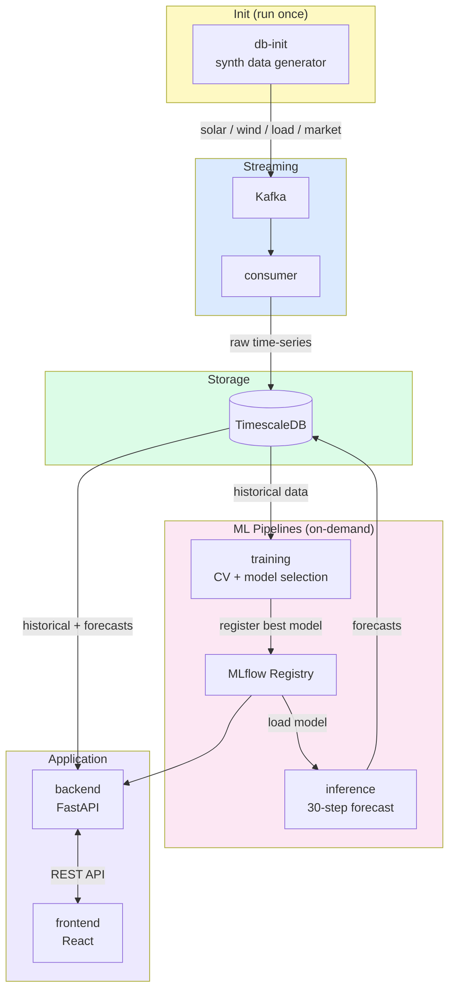

# Virtual Power Plant (VPP) Simulation

[](https://github.com/gmpal/vpp/actions)
[](https://github.com/gmpal/vpp/actions)
[](https://opensource.org/licenses/MIT)

A modular, containerized microservices system for simulating a Virtual Power Plant. The project integrates synthetic data generation, real-time data streaming with Kafka, automated machine learning forecasting with MLflow, and linear optimization with PuLP to emulate energy management decisions for distributed energy resources.

## Table of Contents

- [Overview](#overview)
- [Key Features](#key-features)
- [System Architecture](#system-architecture)
- [Technology Stack](#technology-stack)
- [Prerequisites](#prerequisites)
- [Installation and Setup](#installation-and-setup)
- [Usage](#usage)
- [API Overview](#api-overview)
- [Troubleshooting](#troubleshooting)
- [Contributing](#contributing)

## Overview

This project simulates a **Virtual Power Plant (VPP)** that leverages synthetic data and modular microservices to emulate a real-world distributed energy system. The core idea is to generate synthetic data representing various energy sources and grid parameters, then process, forecast, and optimize energy management decisions in near real-time.

The system is fully containerized using Docker, enabling scalable deployments and simplified local development with Docker Compose.

## Key Features

-   **Synthetic Data Generation**: Generates realistic time-series data for solar (`pvlib`), wind (`windpowerlib`), grid load, and market prices.
-   **Real-Time Data Streaming**: Streams generated data via Kafka producers to a central consumer, simulating live data feeds from distributed assets.
-   **Time-Series Database**: Ingests and stores all historical and forecasted data in a TimescaleDB instance for efficient querying and analysis.
-   **Automated ML Forecasting Pipelines**:
    -   **Training Pipeline**: Runs on a schedule (every 60 mins) to perform time-series cross-validation, compare models (e.g., RandomForest), and log experiments, metrics, and models to **MLflow**.
    -   **Inference Pipeline**: Runs frequently (every 5 mins) to load the best models from the MLflow Registry and generate 30-step-ahead forecasts.
-   **Linear Optimization**: Utilizes **PuLP** to solve an optimization problem that determines the most profitable strategy for battery charging/discharging and grid energy trading based on forecasts.
-   **Interactive Frontend**: A React-based UI allows users to add new energy sources and batteries on-the-fly, and visualize historical data, forecasts, and optimization results.
-   **Modular Microservices**: The entire system is broken down into independent, containerized services (backend, frontend, database, Kafka, pipelines) for scalability and maintainability.

## System Architecture



### Service Summary

| Service | Role | Profile |
|---------|------|---------|
| `db-init` | Schema setup + synthetic data → Kafka | `init` (run once) |
| `consumer` | Kafka → TimescaleDB writer | always-on |
| `backend` | FastAPI REST API | always-on |
| `frontend` | React UI | always-on |
| `training` | Time-series CV, MLflow model registration | `task` (on-demand) |
| `inference` | Load MLflow model, write forecasts to DB | `task` (on-demand) |
| `timescaledb` | Time-series database (PostgreSQL) | always-on |
| `kafka` + `zookeeper` | Message broker | always-on |
| `mlflow` | Experiment tracking + model registry | always-on |

## Technology Stack

| Category              | Technology                                       | Purpose                                                 |
| --------------------- | ------------------------------------------------ | ------------------------------------------------------- |
| **Backend**           | Python, FastAPI                                  | REST API development and business logic.                |
| **Frontend**          | React, TypeScript, Material-UI, Chart.js         | Interactive user interface and data visualization.      |
| **Database**          | TimescaleDB (PostgreSQL)                         | Storing and querying time-series data.                  |
| **Data Streaming**    | Apache Kafka                                     | Real-time messaging between data sources and consumer.  |
| **ML/Forecasting**    | Scikit-learn, pmdarima, Prophet                  | Time-series forecasting models.                         |
| **MLOps**             | MLflow                                           | Experiment tracking, model registry, and logging.       |
| **Optimization**      | PuLP                                             | Linear programming for energy dispatch optimization.    |
| **Containerization**  | Docker, Docker Compose                           | Containerizing and orchestrating all microservices.     |
| **Data Generation**   | `pvlib`, `windpowerlib`                          | Creating synthetic solar and wind energy data.          |

## Prerequisites

-   Docker & Docker Compose
-   Python 3.8+ (for running scripts outside Docker)
-   Node.js (for frontend development outside Docker)

## Installation and Setup

The entire system is containerized. You must use `docker-compose` to run it.

1.  **Configure Environment:**
    Create a file named `.env` in the root directory and add the configuration (see provided `.env` example above).

2.  **Start Core Infrastructure:**
    Launch the database, Kafka, and MLflow.
    ```bash
    docker-compose up -d timescaledb zookeeper kafka mlflow
    ```

3.  **Start the Data Consumer:**
    This service listens to Kafka and saves data to the database.
    ```bash
    docker-compose up -d consumer
    ```

4.  **Initialize Database & Start Streaming:**
    **Important:** This runs once to set up database tables and start generating synthetic data.
    ```bash
    docker-compose --profile init up db-init
    ```

5.  **Start Application Services:**
    Launch the backend API and the frontend UI.
    ```bash
    docker-compose up -d backend frontend
    ```

6.  **Run ML Pipelines (On Demand):**
    These services are not always running; they are tasks you trigger.
    ```bash
    # Run training
    docker-compose --profile task up training

    # Run inference
    docker-compose --profile task up inference
    ```
Once all services are running, you can access the different components:
-   **Frontend UI**: `http://localhost:3000`
-   **Backend API Docs**: `http://localhost:8000/docs`
-   **MLflow UI**: `http://localhost:5000`

## Usage

After starting the services, the system will begin simulating the VPP:

1.  **Data Generation & Streaming**: The `db-init` service will continuously produce new data points for all sources and push them to Kafka topics.
2.  **Data Ingestion**: The `consumer` service will ingest this data and save it to TimescaleDB.
3.  **Forecasting**: The `training` and `inference` pipelines will run automatically on their schedules (or you can trigger them manually as shown above) to keep the forecasts up-to-date.
4.  **Interacting with the UI**:
    -   Navigate to `http://localhost:3000`.
    -   **Dashboard**: Add new solar/wind generators or batteries. View the current status of all devices.
    -   **Renewables/Grid/Market Tabs**: Visualize historical and forecasted data for different sources.
    -   **Optimization Tab**: Trigger the optimization engine and view the recommended battery and grid dispatch strategy.

## API Overview

The backend provides a RESTful API for interacting with the VPP. Key endpoints include:

-   `GET /health`: Health check for the backend service.
-   `GET /api/batteries`: Get the status of all batteries.
-   `POST /api/batteries`: Add a new battery to the system.
-   `POST /api/batteries/{battery_id}/charge`: Charge a specific battery.
-   `GET /api/add-source?source_type={type}`: Add a new renewable energy source (`solar` or `wind`).
-   `GET /api/historical/{source}`: Query historical data for a source (e.g., `solar`, `load`).
-   `GET /api/forecasted/{source}`: Query forecasted data for a source.
-   `POST /api/optimize`: Run the optimization algorithm and get the dispatch strategy.

For a full list of endpoints and their parameters, see the auto-generated Swagger documentation at `http://localhost:8000/docs`.

## Troubleshooting

-   **Service Fails to Start**: Check the logs for the specific service using `docker-compose logs <service_name>`.
-   **No Data in Frontend**:
    -   Ensure the `db-init` service ran successfully and is producing messages.
    -   Check the `consumer` logs to see if it's receiving messages and writing to the database.
    -   Verify the `backend` can connect to `timescaledb`.
-   **MLflow UI is Empty**: Make sure the `training` pipeline has run at least once. Trigger it manually if needed.

## Contributing

Contributions are welcome! See [CONTRIBUTING.md](CONTRIBUTING.md) for branch conventions, coding standards, and the PR process.
